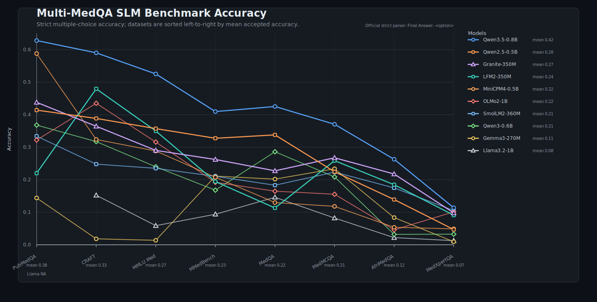
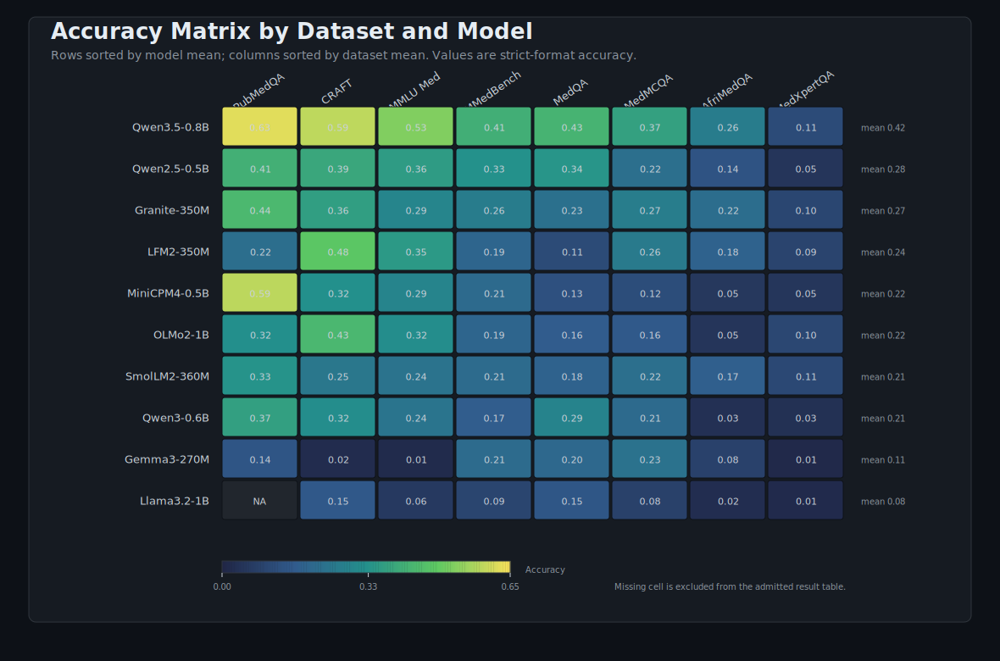

# Multi-MedQA SLM Benchmark

A reproducible benchmark suite for evaluating small language models on medical multiple-choice question answering across multilingual, regional, and specialty-focused datasets.

This repository contains a unified inference and evaluation pipeline, model and dataset configuration files, and a public summary of the final benchmark results. The benchmark is designed around fairness: within each dataset column, all models are evaluated on the same canonical test set, with the same prompt semantics, answer mapping, decoding settings, and parser.





## Benchmark Scope

The benchmark covers eight medical QA datasets:

| Dataset | Rows per model | Scope |
| --- | ---: | --- |
| MedQA / USMLE | 6,112 | Mainland, Taiwan, and US MedQA test files |
| MedMCQA | 4,183 | Public labeled validation split |
| PubMedQA | 500 | Official PQA-L test set |
| MedXpertQA Text | 2,450 | Text-only MedXpertQA test split |
| MMLU medical subsets | 1,089 | Six medical or biomedical MMLU test subjects |
| MMedBench multilingual | 8,518 | English, Chinese, Japanese, French, Russian, and Spanish |
| AfriMedQA Expert MCQ | 3,910 | Expert MCQ test subset |
| CRAFT-MedQA XL | 25,000 | XL synthetic medical QA variant |

The evaluated model set includes Qwen3.5-0.8B, Qwen2.5-0.5B-Instruct, Qwen3-0.6B, Granite 4.0 350M, Gemma 3 270M IT, SmolLM2-360M-Instruct, OLMo-2-0425-1B-Instruct, Llama 3.2 1B Instruct, MiniCPM4-0.5B, and LFM2-350M.

## Results

The table below reports final strict-format accuracy. An empty cell means that no reliable score was admitted to the main table.

| Model | MedQA | MedMCQA | PubMedQA | MedXpertQA | MMLU Med | MMedBench | AfriMedQA | CRAFT |
| --- | ---: | ---: | ---: | ---: | ---: | ---: | ---: | ---: |
| Qwen3.5-0.8B | 0.4252 | 0.3705 | 0.6280 | 0.1139 | 0.5253 | 0.4096 | 0.2629 | 0.5902 |
| Qwen2.5-0.5B-Instruct | 0.3379 | 0.2245 | 0.4140 | 0.0469 | 0.3572 | 0.3275 | 0.1391 | 0.3885 |
| Qwen3-0.6B | 0.2860 | 0.2087 | 0.3680 | 0.0327 | 0.2397 | 0.1679 | 0.0320 | 0.3173 |
| Granite 4.0 350M | 0.2274 | 0.2675 | 0.4380 | 0.0980 | 0.2902 | 0.2623 | 0.2176 | 0.3644 |
| Gemma 3 270M IT | 0.2019 | 0.2338 | 0.1440 | 0.0094 | 0.0138 | 0.2111 | 0.0836 | 0.0183 |
| SmolLM2-360M-Instruct | 0.1832 | 0.2235 | 0.3340 | 0.1053 | 0.2351 | 0.2104 | 0.1749 | 0.2479 |
| OLMo-2-0425-1B-Instruct | 0.1648 | 0.1554 | 0.3220 | 0.1012 | 0.3159 | 0.1922 | 0.0460 | 0.4350 |
| Llama 3.2 1B Instruct | 0.1461 | 0.0822 |  | 0.0127 | 0.0588 | 0.0939 | 0.0220 | 0.1523 |
| MiniCPM4-0.5B | 0.1299 | 0.1181 | 0.5880 | 0.0490 | 0.2883 | 0.2077 | 0.0537 | 0.3238 |
| LFM2-350M | 0.1132 | 0.2587 | 0.2200 | 0.0910 | 0.3499 | 0.1943 | 0.1847 | 0.4795 |

## Repository Layout

```text
.
├── configs/
│   ├── models.json              # Model adapter configuration
│   └── datasets/                # Dataset-specific canonical evaluation configs
├── CITATION.cff                 # Machine-readable citation metadata
├── figures/                     # Publication-style result visualizations
├── infer.py                     # Unified full-precision inference script
├── LICENSE                      # Apache-2.0 license for repository code
├── THIRD_PARTY.md               # Upstream dataset/model source notes
└── eva.py                       # Strict evaluator with optional diagnostic mode
```

Generated outputs are intentionally not part of the public repository. When users reproduce the benchmark locally, outputs should follow this convention:

```text
Outputs/<dataset>/<model>/<model>.jsonl
```

The public release excludes generated outputs, smoke-test outputs, old template variants, partial runs, diagnostic reruns, execution logs, internal notes, and local orchestration files.

The final result set summarized here contains 79 accepted model-dataset cells. The only missing cell is Llama 3.2 1B Instruct on PubMedQA: the run produced mostly abstract summaries or explanations rather than a reliable multiple-choice response, so it is excluded from the main table.

## Evaluation Policy

The official score is strict accuracy under the required answer format:

```text
Final Answer: <option letter>
```

For multi-answer datasets, predictions are evaluated by exact set match over option letters. The evaluator supports A-J option labels for 10-choice datasets.

Compatibility changes are allowed only when they do not alter benchmark semantics, such as tokenizer padding, pad-token fallback, chat template enablement or disablement, batch-size changes for stability, and required Transformers runtime versions. Dataset prompts, answer mappings, and scoring rules are not changed for individual models.

## Result Audit Summary

The final reported results include only admitted benchmark runs. Excluded artifacts include smoke-test outputs, `.test.jsonl` files, old chat-template runs, partial runs, diagnostic reruns, overrun backups, and execution logs.

The accepted-result audit is:

| Dataset | Accepted files | Formal N | Correct | Invalid | Multi-answer N | Multi-answer correct | Accuracy |
| --- | ---: | ---: | ---: | ---: | ---: | ---: | ---: |
| MedQA / USMLE | 10 | 61,120 | 13,544 | 13,499 | 0 | 0 | 0.2216 |
| MedMCQA | 10 | 41,830 | 8,952 | 11,355 | 0 | 0 | 0.2140 |
| PubMedQA | 9 | 4,500 | 1,728 | 850 | 0 | 0 | 0.3840 |
| MedXpertQA Text | 10 | 24,500 | 1,620 | 9,033 | 0 | 0 | 0.0661 |
| MMLU medical subsets | 10 | 10,890 | 2,912 | 3,189 | 0 | 0 | 0.2674 |
| MMedBench multilingual | 10 | 85,180 | 19,394 | 15,743 | 3,400 | 30 | 0.2277 |
| AfriMedQA Expert MCQ | 10 | 39,100 | 4,757 | 13,539 | 3,100 | 43 | 0.1217 |
| CRAFT-MedQA XL | 10 | 250,000 | 82,929 | 64,298 | 0 | 0 | 0.3317 |
| **Total** | **79** | **517,120** | **135,836** | **131,506** | **6,500** | **73** | **0.2627** |

Within each dataset, accepted outputs were checked for consistent source files, questions, option mappings, gold answers, prompts, prompt languages, and multi-answer flags across models.

## Model and Runtime Notes

Most model-dataset cells use the default model configuration in `configs/models.json`. The following compatibility adjustments are part of the admitted benchmark protocol:

- Qwen3.5-0.8B uses a newer Transformers runtime where required for model loading.
- Qwen3-0.6B uses `--no-chat-template` on MedMCQA, MedXpertQA Text, MMLU medical subsets, and CRAFT-MedQA XL where the default chat-template path produced placeholder-style answers.
- OLMo-2-0425-1B-Instruct uses `--no-chat-template` on MedMCQA, PubMedQA, MedXpertQA Text, MMLU medical subsets, and CRAFT-MedQA XL for format stability.
- Gemma 3 270M IT uses chat-template outputs for MedQA, MedMCQA, and PubMedQA, and no-chat outputs where no reliable chat template was available in the execution environment.
- MiniCPM4-0.5B requires a Transformers 4.57-compatible runtime.

These adjustments affect model loading or answer-format stability only. They do not change dataset content, gold labels, prompts, or scoring rules for individual models.

## Reproducing Evaluation

After generating or placing local outputs under `Outputs/`, evaluate one dataset:

```bash
python eva.py Outputs/medqa_usmle --summary-only
```

Evaluate all local outputs:

```bash
python eva.py Outputs --summary-only
```

Run an optional strict-vs-lenient diagnostic report on local outputs:

```bash
python eva.py Outputs/craft_medqa_xl --summary-only --lenient-diagnostic
```

The diagnostic mode can help explain format-following failures, but it is not the official scoring policy.

## Running Inference

Inference is handled by `infer.py` using model and dataset configuration files:

```bash
python infer.py \
  --model-path /path/to/model \
  --model-name <model-name> \
  --dataset-config configs/datasets/medqa_usmle.json
```

The script expects locally available model weights and canonical dataset files. By default, models are loaded in full precision (`torch.float32`) for comparability.

## Data and Model Availability

This repository does not redistribute upstream datasets or model weights. Users should obtain them from their original providers and comply with the corresponding licenses and access policies. Dataset configuration files document the expected canonical file layout and row counts used in this benchmark.

See `THIRD_PARTY.md` for the upstream dataset and model source list. Users should cite upstream datasets and models in addition to this repository.

## Limitations

- Scores reflect strict multiple-choice answer extraction, not free-form clinical reasoning quality.
- Some low scores are caused by instruction-following or formatting failures under the fixed prompt.
- Multi-answer datasets use exact set match, which is intentionally conservative.
- The benchmark is text-only; multimodal dataset splits are excluded.

## Citation

If you use this benchmark, cite this repository and the original dataset and model sources used in your study. The repository includes `CITATION.cff` for citation managers and GitHub citation metadata.

```bibtex
@software{ma_2026_multi_medqa_slm_benchmark,
  author = {Ma, Chiyuan},
  title = {Multi-MedQA SLM Benchmark},
  year = {2026},
  url = {https://github.com/machiyuan03/multi_medqa_datasets_slm_benchmark},
  license = {Apache-2.0}
}
```

## License

The repository code and configuration files are released under the Apache License 2.0. See `LICENSE`.

Datasets and model weights are not redistributed and remain governed by their original licenses and access terms.
